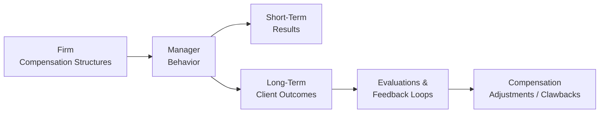

It might sound a little funny to admit, but I once worked with a small asset management firm where, every December, the office turned into a pressure cooker. Target-based bonuses came due after the holidays, and let me tell you, you could sense the tension in the hallway. People were hyper-focused on short-term performance. Well, that was great for immediate revenue, but—unfortunately—less so for the firm’s reputation and, crucially, for its clients’ longer-term outcomes. Now, in this section, we'll explore why an ethically aligned compensation structure can help minimize that tension, align employees' goals with client interests, and encourage more sustainable decision-making over the long haul.

## Ethical Compensation Principles

In an asset management environment, how people get paid significantly influences their behavior. Think about it: if a portfolio manager knows their entire bonus depends on returns during a single quarter, they might be, well, tempted to take on excessive risk to chase higher returns. This often leads to short-sighted strategies that put the client’s best interests in jeopardy. The CFA Institute’s Asset Manager Code underscores that the compensation model must align employees’ financial incentives with ethical and professional responsibilities—so that short-term gains don’t overshadow client well-being.

Aligning pay with your firm’s values and the Code’s general principles means implementing systems that reward consistent, ethical choices rather than purely numerical milestones. For instance, while you do still want to measure performance, it’s good to weigh factors like integrity, teamwork, and client satisfaction. That way, your employees know the firm genuinely cares about moral responsibilities, not just about trades that produce a quick upside.

### Balancing Risk and Customer Outcomes

An important aspect of ethical compensation structures is balancing risk with outcomes. The manager’s pay must not seduce them into excessive speculation or ignoring compliance obligations. An effectively designed plan ties financial rewards to results over a reasonable time horizon—long enough to validate that those results came from sincere skill and ethical practice rather than risk-taking mania. Furthermore, these structures should incorporate negative feedback loops, like penalties or reduced payouts if findings later show that managers misrepresented performance or put client capital at undue risk. The ultimate goal is fostering consistent trust between clients and asset managers.

## Common Compensation Models

To get more practical, let’s explore a few popular compensation models that firms typically adopt, and how they can be shaped to promote ethical conduct.

### Base Salary + Bonus

The simplest structure combines a fixed salary plus some variable bonus. This model is often used because it’s flexible—base salary provides stability, whereas the bonus portion can focus on performance metrics.

• Ethical Twist: If the bonus is pegged only to short-term returns, managers might push the envelope. But if the bonus includes behavioral or client satisfaction indicators—like client retention or adherence to compliance guidelines—then you’re encouraging your teams to think beyond just last quarter’s performance. You can also factor in multi-year parameters so that the full bonus only vests if long-term objectives are met.

• Example: Suppose a firm sets a baseline bonus target but links 40% of that bonus to a manager’s three-year performance track record. Another 20% is tied to client satisfaction surveys, and the remainder is contingent upon meeting specific ethical and compliance-oriented goals (e.g., zero compliance breaches, timely client communications). That structure prevents managers from chasing short-term wins, because part of the payoff only arrives if they continually meet ethical and performance standards.

### Profit Participation or Carried Interest

In some investment models—especially in private equity or hedge funds—managers are granted a share of the profits (carried interest) once returns surpass a set hurdle rate. The logic is that managers only get paid well after they have generated positive outcomes for investors, encouraging them to adopt a more measured, skill-based approach.

• Ethical Concern: Carried interest can still be abused. For instance, if there is no robust risk monitoring, a manager could engage in “portfolio doping” (a nickname for piling on hidden leverage or exotic derivatives) to artificially inflate returns. Once the carried interest is paid out, the manager might not face personal consequences if the inherent risk eventually triggers losses.

• Clawback Mechanism: One powerful safeguard is the clawback provision. If future performance dips, or if revelations appear of wrongdoing, the firm recovers some or all of the carried interest. This ensures that managers are not just rewarded for a quick spike in returns but also remain accountable for long-term outcomes.

### Deferred Compensation

Deferred compensation is a slice of pay withheld until a later date—often tied to sustained performance. It’s a nifty strategy that encourages long-term thinking. Employees who know a portion of their compensation vests over several years have less incentive to cut ethical corners now, because any unethical gain might unravel their future payoff.

• Example: Let’s say 30% of a portfolio manager’s annual bonus is held back for three years. If, after that period, all compliance checks are in order, performance remains stable, and no misconduct surfaces, the payments are released. If evidence emerges that the manager inflated valuations or otherwise violated policy, the firm can withhold or reduce the deferred compensation.

## Clawback Provisions

Clawbacks allow the firm to reclaim previously granted compensation upon discovering certain undesirable factors: maybe the manager engaged in misconduct, or performance was artificially puffed up through questionable practices. Clawbacks send a strong signal that compensation is truly “on the line” if behaviors fail to align with ethical norms.

When I talk with asset managers, I often hear them say, “But clawbacks can sour relationships with employees!” Sure, no one wants to see their pay retracted. However, in practice, employees who are serious about compliance (the ones you’d like to keep) generally appreciate that clawbacks protect the firm’s reputation and reinforce trust with clients. It basically sets a common baseline: “We’re all in this together, and if you break the rules, we aren’t going to foot the bill.”

### Practical Considerations

Implementing clawbacks typically requires:

• Clear Contractual Language: An employee contract specifying the grounds for enforcing a clawback, such as restating earnings, compliance breaches, or fraudulent activity.  
• Objective Triggers: Transparent metrics about what triggers a clawback and how it’s calculated.  
• Enforcement Strategy: Documented procedures for retrieving the money—like adjusting future payouts or requiring direct repayment.  

In large firms, it’s not unusual to see multi-tiered clawbacks. For instance, a portion of the manager’s compensation is subject to immediate partial clawback if performance was grossly misstated; another portion might remain at risk for 2–3 years for compliance or risk management issues discovered later.

## Behavioral Metrics

Creating an ethical culture goes beyond balancing quantitative performance with risk. It also means rewarding the intangible qualities that foster trust and stability. That’s where behavioral metrics step in, which I like to think of as the “soft skill scoreboard” for your firm.

### Qualitative Feedback Measures

• Peer Evaluations: Co-workers assess each other’s collaboration, honesty, and respect for procedures.  
• Subordinate Feedback: Does a manager mentor junior analysts? Does she encourage open discussion and regularly champion ethical concerns?  
• Client Reviews: Are clients satisfied with the quality and transparency of communications? Are they confident decisions are in their best interests?

### Linking Behavior to Compensation

A portion of an employee’s bonus or salary increase can hinge on this feedback. That might sound subjective, and it can be, but well-defined rating scales and consistent implementation help mitigate that. Ultimately, weaving these behavioral elements into compensation signals that the firm prizes integrity as much as ROI. 

## Visualizing Compensation Alignment

Below is a simple diagram to illustrate key elements of ethical compensation structures. The flowchart shows how the firm’s policies affect both manager behavior and client outcomes, and how clawbacks might come into play.

In this diagram, note that the firm’s policies (A) guide the manager’s day-to-day behavior (B). The manager’s behavior influences both short-term performance (C) and longer-term client outcomes (D). Meanwhile, extended evaluations (E) feed back into compensation adjustments (F), including potential clawbacks.

## Addressing Potential Challenges

Obviously, no system is perfect, and implementing fair, ethical pay structures can be tricky. Here are a few pitfalls:

• Overreliance on Qualitative Metrics: If “ethics” become a fuzzy set of checkboxes, employees may find ways to game the system. Clear guidelines and diverse evaluation committees can reduce subjectivity.  
• Inadequate Time Horizon: If performance measurement remains too short-term, the compensation structure might revert to the same old short-term mania.  
• Inconsistent Enforcement: If the firm only penalizes certain managers or overlooks some borderline behavior, employees will suspect favoritism or confusion. Everyone must know that these rules apply fairly and consistently.  
• Cultural Resistance: Some employees might push back, particularly if they’re used to more immediate payouts. Firms can mitigate friction by explaining how these measures support the client’s best interests and ensure the firm’s long-term stability.

## Integrating Compensation Ethics at Level III

From a CFA Level III exam perspective, you might be asked to evaluate how hypothetical compensation plans could conflict with the Code and Standards. Or you might get a scenario where a manager is making questionable moves to lock in a year-end bonus. The best approach is to consider how each compensation model might inadvertently motivate unethical or excessively risky choices—and then outline a fix. For instance, a question might revolve around designing a compensation plan for a newly launched hedge fund that addresses long-term performance while mitigating potential ethical conflicts.

## Exam Tips

• Familiarize yourself with the Code’s stance on compensation. The Asset Manager Code is quite emphatic that client interests must remain paramount, and that compensation structures should not introduce undue risk appetites.  
• Prepare to connect the dots between risk management, compliance, and compensation. The exam often tests cross-linkages: how a risk oversight deficiency might spur unethical behavior in pursuit of a bonus, for example.  
• Think about intangible aspects. The CFA exam’s essay questions often revolve around real-world scenarios that incorporate both quantitative performance data and softer issues—like organizational culture, client communication, or conflict of interest.  
• Practice short-case analyses. Many exam item sets might present you with performance data over multiple years plus statements from a manager or colleague. Summarize how that data suggests certain compensation pitfalls and ethical lapses—and propose solutions.

## References

• CFA Institute. (2020). “Ethics in Incentive Structures: A Guide for Asset Management Firms.”  
• Murphy, K. J. (2018). “Executive Compensation: Where Are We Now?” Annual Review of Financial Economics.  
• Bebchuk, L. A., & Fried, J. (2009). “Pay without Performance: The Unfulfilled Promise of Executive Compensation.”  

For further reading, you might also explore:  
• CFA Institute (2020). Standards of Practice Handbook.  
• Financial Times Guides: “Executive Pay and Corporate Governance.”  
• Harvard Business Review articles on the psychology of incentives in finance.

--------------------------------------------------------------------------------

## Test Your Knowledge: Aligning Compensation Structures with Ethical Conduct



### Which of the following best describes a critical objective when designing ethical compensation structures?

- [ ] Maximizing short-term performance metrics.  
- [x] Encouraging behavior that prioritizes the client’s long-term interests.  
- [ ] Minimizing the complexity of bonus calculations to ensure clarity.  
- [ ] Eliminating all forms of performance-based compensation.  

> **Explanation:** An ethical compensation model must align employee incentives with client well-being over the long run, rather than rewarding quick, potentially reckless gains.

### Base salary plus bonus structures can be enhanced ethically by:

- [x] Tying a portion of the bonus to multi-year performance and qualitative behavioral assessments.  
- [ ] Tying 100% of the bonus strictly to annual financial returns.  
- [ ] Holding bonuses constant regardless of client satisfaction.  
- [ ] Paying all compensation in the form of immediate lump sums.  

> **Explanation:** A combination of performance measures and qualitative incentives, assessed over a longer horizon, tends to reduce undue risk-taking and supports ethical behavior.

### Which of the following can be a downside of profit participation (carried interest) if not used with appropriate safeguards?

- [x] Managers might shift risk-taking to inflate short-term valuations.  
- [ ] Managers might lose all their compensation immediately.  
- [ ] Employees are discouraged from working efficiently.  
- [ ] Clients are forced to pay lower fees overall.  

> **Explanation:** When a manager’s bonus depends solely on near-term profit targets, they may take on excessive risk or inflate valuations to collect payouts more quickly.

### Which statement about clawback provisions is most accurate?

- [ ] Clawback provisions only apply to base salaries.  
- [ ] Clawback provisions cannot be applied if the employee has left the firm.  
- [ ] Clawback provisions are legally required in all financial markets.  
- [x] Clawback provisions allow a firm to reclaim compensation if misconduct or misrepresented performance is discovered later.  

> **Explanation:** The fundamental purpose of clawbacks is to retrieve past awards if there was misconduct or if performance results prove to be fraudulent or overstated.

### Why are behavioral metrics important in aligning compensation with ethical behavior?

- [x] They emphasize values like honesty, communication, and collaboration.  
- [ ] They replace all quantitative performance measures.  
- [x] They provide peer or subordinate feedback that highlights day-to-day conduct.  
- [ ] They make it easier to identify potential insider trading.  

> **Explanation:** Behavioral metrics recognize actions that reflect or undermine the firm’s ethical culture while capturing peer and client input—critical for shaping responsible, purposeful conduct.

### A major challenge when tying compensation to ethics-based metrics is:

- [x] Potential subjectivity in evaluating qualitative behaviors.  
- [ ] Lower overall salaries for employees.  
- [ ] The complete absence of short-term goals.  
- [ ] Eliminating the need for compliance monitoring.  

> **Explanation:** Utilizing qualitative feedback and ethical standards necessitates careful structuring to avoid bias and ensure that metrics are fair and consistently applied.

### Under a deferred compensation system that includes clawbacks:

- [x] Part of the employee’s pay is withheld until after performance and conduct have been verified over a set period.  
- [ ] The employee receives all pay immediately upon contract signing.  
- [x] The firm can reclaim that deferred amount if misconduct is discovered.  
- [ ] The employee can never be terminated for unethical behavior because they have vested interest in the bonus.  

> **Explanation:** Deferred pay plus clawback provisions lock in accountability. Employees must maintain ethical standards through the deferral period or risk losing that portion of their compensation.

### When implementing clawback policies, it is most crucial that:

- [x] The trigger conditions are clearly explained and consistently enforced.  
- [ ] Only executive-level employees are subject to these rules.  
- [ ] Firms do not define a time horizon for possible clawbacks.  
- [ ] They apply solely to high-performing managers to keep bonuses lower.  

> **Explanation:** Firms should communicate unambiguous, consistent triggers and calculations for clawbacks to avoid perceptions of favoritism or confusion about the policy’s legitimacy.

### A potential benefit of combining both quantitative and qualitative metrics in performance evaluations is:

- [x] It reduces the likelihood of purely short-term or unethical decision-making.  
- [ ] It eliminates the need for a base salary.  
- [ ] It guarantees that managers never breach compliance standards.  
- [ ] It requires every manager to adopt identical investment strategies.  

> **Explanation:** Blending financial targets with behavioral measures encourages balanced, ethically conscious decisions rather than obsessively targeting a single numeric goal.

### Clawback provisions are an effective mechanism to ensure ethical behavior. True or False?

- [x] True  
- [ ] False  

> **Explanation:** Clawbacks deter unethical and excessive risk-taking by forcing managers to remain accountable for returns and conduct even after initial compensation has been paid out.


