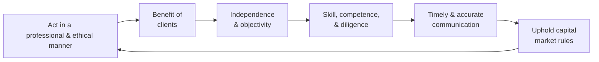

The Asset Manager Code (AMC) sets out six essential principles that guide ethical behavior and promote trust with clients, colleagues, regulators, and broader communities. These principles are at the heart of responsible investment management. They provide asset managers with tangible guidelines for dealing with everyday ethical dilemmas, strategic decisions, and complex client relationships. Whether you’re a seasoned portfolio manager or just starting your career, an unwavering commitment to these foundational principles helps preserve the integrity of the profession.

The following discussion explores each principle in depth, touching on real-world examples, potential pitfalls, and practical ways to implement them. By weaving personal experiences and case studies into the narrative, the goal is to bring these concepts to life in a way that resonates with both your academic learning and day-to-day practices.

The Value of Always Acting Professionally and Ethically  
It might sound obvious, but consistently acting in a professional and ethical manner can be surprisingly challenging. Sometimes, the pressure to meet short-term performance goals can overshadow the long-term objective of building a credible reputation. I still remember that time early in my career when a senior colleague casually suggested “polishing” performance reports before sending them to a critical client. You know, the “everyone does it” sort of thing. In that moment, I had a choice: accept a small compromise of the data (which felt easier) or speak up and ensure everything was transparently disclosed. Sticking to professional and ethical standards—documenting the rationale for actual returns, clarifying the assumptions, and resisting any “polishing”—felt a bit nerve-wracking at first. But in hindsight, it built trust with that client and eventually led to stronger long-term partnerships.

Acting in a professional and ethical manner involves:  
• Upholding integrity and honesty in all communications.  
• Demonstrating fairness in negotiations, collaborations, and daily interactions.  
• Balancing pressures for efficiency with a steadfast commitment to truthfulness in reporting, advertising, and record-keeping.

When these behaviors become second nature, you’ll likely find that colleagues and clients see you as not just “technically sound” but also “reliable,” effectively enhancing both personal reputation and firm-wide culture.

Acting for the Benefit of Clients  
Few ethical mandates are stronger than “putting clients’ interests ahead of your own.” If you’ve ever recommended a security or strategy that wasn’t truly suitable just to retain a client (or if you’ve felt pressured to do so), you understand how real this conflict can become. In advanced portfolio management, this principle plays out through:  

• Avoiding or disclosing conflicts of interest. For example, if your firm has a proprietary product that you’re expected to market but it’s not the best fit for a particular client, you should either refrain from recommending it or fully disclose your firm’s interest in promoting it.  
• Ensuring objective research underpins every recommendation, so you’re not influenced by the potential for higher fees or performance incentives.  

Placing clients’ interests first also extends to guaranteeing that fee structures, risk disclosures, and return potentials are explained in plain language. Even if your clients or prospects are less sophisticated, they deserve a transparent view of how your investment approach aligns with their goals. And there’s an interesting irony: the more you truly focus on what’s best for your clients, the more likely you are to enjoy their loyalty, leading to better retention and growth over time.

Balancing Independence with Objective Judgment  
It’s easy to think of independence and objectivity as intangible ideals, but they become vital safeguards in real situations—especially in large, matrix-like organizations. Picture a scenario where a star analyst in your firm is known for generating huge trading revenues, but you suspect their analysis is influenced by their personal stake in certain deals. The “star power” can create subtle intimidation or undue influence on colleagues who might fear challenging them.  

A good step to preserve independence is to involve compliance or a designated risk manager when you sense that someone is using their influence to push questionable trades or strategies. A strong compliance culture can buffer those pressures by facilitating the reporting of concerns anonymously or through well-defined channels. Even if you’re junior, the presence of a supportive and robust compliance environment can help you maintain that objective lens.

In practical terms, managers who want to uphold independence and objectivity can:  
• Maintain well-documented research procedures and sources for analysis.  
• Encourage open group discussions free from fear of retaliation.  
• Institute rotation policies or peer reviews for critical tasks, like pricing illiquid assets.

By making decisions that are demonstrably free from undue influence, your firm (and you personally) signal to markets and clients that your advice is based on fair and careful consideration.

The Importance of Skill, Competence, and Diligence  
Markets are ever-changing. New financial regulations pop up, technology evolves (think algorithmic trading and AI-based analytics), and client circumstances shift as their personal or business needs evolve. This means you can’t just rest on your laurels, even if you have a few decades of experience. Continuously developing your human capital—learning about new products, updated regulations, or advanced risk profiling methods—reflects not only professional growth but also a genuine respect toward your clients.

Skill and competence become critical when:  
• Determining asset allocation for a client with a unique risk-return preference, e.g., an endowment with a multi-generational horizon.  
• Assessing the rapidly changing regulatory environment, especially if you manage assets in multiple countries or deal with complex instruments such as derivatives or structured products.  
• Evaluating the ethical ramifications of emerging technologies, like how to handle client data in compliance with privacy regulations.

Diligence also involves thorough documentation. Whether it’s a detailed write-up on why a certain sector was overweighted or a justification for shifting to an alternative investment strategy, having a proper paper (or digital) trail clarifies your thought process and ensures accountability. A well-documented approach can protect you if someone questions the outcome later.

Keeping Communication Timely and Accurate  
Have you ever had one of those “Where’s that performance report?” calls from a concerned client? Communicating clearly and promptly isn’t just about delivering data; it’s about providing context. Clients appreciate transparency about fees, performance, and potential risks—especially in markets where volatility can spike quickly.  

Some practices to strengthen timely and accurate communication:  
• Establish a regular reporting schedule that your clients can rely on.  
• Disclose all fees (including hidden or indirect costs) so clients know exactly how much they are paying.  
• Provide risk insights in plain language, letting clients know how macroeconomic, geopolitical, or company-specific factors might impact their portfolios.  
• Have open channels for questions and clarifications. Because, let’s face it, if a client is paying for your expertise, they deserve to understand how you’re making decisions with their money.

Upholding Market Rules  
In heavily regulated markets—like the U.S. or the EU—abiding by laws and regulations is crucial for avoiding fines, penalties, or reputational damage. But it goes beyond compliance. It’s about championing market integrity. For instance, if you witness questionable behavior—maybe a colleague receiving inside information that hasn’t been disclosed publicly—the principle instructs you to take action. That might mean reporting the misconduct to your firm’s legal or compliance department, or, in extreme cases, contacting external authorities.

Upholding market rules means:  
• Not engaging in or tolerating insider trading or front-running.  
• Refusing to manipulate prices or obfuscate relevant market information.  
• Cooperating with regulators’ requests for data or documentation.  

In many countries, whistleblower protections exist to shield individuals from retaliation. Upholding market rules isn’t just about staying out of trouble; it’s about fostering trust in the entire industry.

Interconnectedness of All Six Principles  
While these six principles can be discussed individually, they operate as a mutually reinforcing ecosystem. Acting ethically fosters better client relationships. Placing clients’ interests first ensures your communications remain timely and transparent. And operating with independence and competence makes it easier to detect or resist manipulative tactics. The synergy among these principles creates a strong organizational culture that benefits your clients, your firm, and the market at large.

Below is a simple diagram that shows how these principles interconnect in practice. The flow isn't strictly linear; rather, each principle shapes and reinforces the others.

In the above chart, each principle is depicted in a cycle, illustrating how one naturally leads to and overlaps with the next.

Best Practices  
• Develop a clear code of conduct within your firm that references these principles.  
• Offer training sessions so all team members understand evolving regulations, new market products, and advanced ethical scenarios.  
• Encourage a “speak up” culture. Even small concerns can highlight bigger systemic problems.  
• Document ethical decision-making with rationales that can be reviewed by compliance or legal teams, adding clarity and accountability.  

Common Pitfalls and Challenges  
• Overlooking client interests in favor of short-term performance metrics can strain long-term relationships.  
• Failing to refresh knowledge or skill sets can lead to outdated portfolio strategies and higher operational risks.  
• Undisclosed conflicts of interest, such as recommending a related party’s fund without telling clients, can damage trust if discovered.  
• Poor communication around fees or performance can lead to legal disputes, especially if a client feels misled.  

Strategies to Overcome Pitfalls  
• Conduct periodic “ethical audits” to evaluate whether decisions truly support each principle.  
• Rotate staff or use peer reviews for critical tasks to reduce the risk of biased decision-making.  
• Update operational manuals to include real-world examples of conflicts of interest and how to address them.  
• Set measurable communication goals—e.g., respond to client queries within 24 hours or provide quarterly fee breakdowns in plain language.  

Exam Considerations and Real-World Scenarios  
For the CFA Level III exam, don’t be surprised if you encounter item sets or constructed-response questions involving a portfolio manager facing a conflict of interest, or an analyst pressured by superiors to tweak some numbers. You may need to:  
• Identify the specific principle at stake.  
• Evaluate the ethical breach and propose corrective measures.  
• Suggest the correct course of action using the Code and Standards.  

In real life, the best safeguard is an internal compass guided by these six principles, combined with an external structure of compliance and peer accountability.

References for Further Exploration  
CFA Institute. (2019). “Asset Manager Code,” Section on the Six General Principles.  
Trevino, L. K., & Nelson, K. A. (2016). “Managing Business Ethics.” Wiley.  

Exam Tips  
• Familiarize yourself thoroughly with the AMC text and the official interpretations of these principles.  
• Keep an eye out for “gray area” scenarios—practices that might not be explicitly illegal but do not fully align with the spirit of ethical conduct.  
• Practice drafting short, structured answers explaining how you would handle an ethical dilemma, referencing the relevant principles.  
• Be prepared to discuss how these principles apply when working across different regulatory regimes.  

Remember that ethical leadership often emerges from everyday actions. Little moments—like correcting a client’s misconception during a call or resisting pressure to overpromise on expected returns—can add up and define your professional standing.  

## Test Your Knowledge: The Six General Principles of Conduct



### Which of the following actions most directly aligns with placing client interests first?

- [ ] Overstating portfolio performance in a recent pitch book.
- [x] Regularly disclosing fee structures and investment risks to clients.
- [ ] Using superior returns in a small sector to distract from general Portfolio underperformance.
- [ ] Prioritizing higher-commission products in recommendations.

> **Explanation:** Placing clients first means providing them with clear, honest information regarding fees and risks. Transparency gives clients a fair opportunity to assess whether services align with their goals.

### What is the primary benefit of maintaining independence and objectivity?

- [ ] Eliminating all conflicts of interest in the firm.
- [x] Reducing the likelihood that external pressures compromise decision-making.
- [ ] Ensuring absolute profit maximization in any market condition.
- [ ] Guaranteeing that compliance reviews are no longer necessary.

> **Explanation:** Independence and objectivity help ensure that recommendations and investment decisions are free from undue influence, protecting both the client and the profession’s integrity.

### A portfolio manager is under pressure from a major client to buy a large position in a stock she deems unsuitable. To address this situation ethically, she should:

- [ ] Simply follow the client’s wish, as the client is paying for the service.
- [ ] Dismiss the request and move on without discussion.
- [x] Document her analysis, communicate her concerns, and escalate if necessary.
- [ ] Transfer the client’s account to a junior analyst.

> **Explanation:** Demonstrating diligence and professional skepticism means carefully documenting one’s analysis and clearly communicating the reasons behind recommendations. If the conflict remains unresolved, escalating it to compliance or other internal structures ensures ethical guidelines are upheld.

### When considering a new derivative strategy, diligence means:

- [ ] Focusing primarily on how the strategy boosts short-term revenue.
- [ ] Offering the new strategy to any client without question.
- [ ] Delegating approval decisions to marketing alone.
- [x] Evaluating the risk factors, regulatory constraints, and client suitability thoroughly.

> **Explanation:** Diligence involves carefully reviewing relevant factors such as risk, regulation, and suitability. The goal is to ensure that any new strategy aligns with client objectives.

### A practical step to enhance timely and accurate communication includes:

- [x] Setting a reliable reporting schedule and sticking to it.
- [ ] Sending performance updates only when numbers are favorable.
- [x] Providing plain-language disclosures about fees and risks.
- [ ] Withholding risk indicators unless specifically asked.

> **Explanation:** Timely and accurate communication implies a consistent schedule and clear disclosures about fees and risks. Clients should never feel left in the dark about what they are paying for or how market changes impact them.

### An example of market rules that must be upheld is:

- [x] Complying with regulations related to insider trading.
- [ ] Bypassing compliance for faster execution.
- [ ] Encouraging staff to keep questionable info to themselves.
- [ ] Obliging new hires to trade on private tips.

> **Explanation:** One must never participate in or tolerate insider trading or other illicit market manipulations. Upholding market rules preserves fairness and transparency in capital markets.

### What best describes the interconnected nature of the six principles?

- [x] They mutually reinforce one another in driving ethical culture.
- [ ] Each principle stands completely alone with no overlap.
- [x] Violating one principle often suggests a breakdown in others as well.
- [ ] They apply only to senior management.

> **Explanation:** These principles are deeply interdependent: failing to communicate disclosure documents on time, for instance, may also indicate a lack of client-centric behavior or professional diligence.

### A new junior analyst worried about retaliation if they raise concerns about unethical practices should:

- [x] Consult with compliance or a trusted mentor about the issue.
- [ ] Ignore the matter until they are promoted.
- [ ] Publicly confront seniors without any proof.
- [ ] Immediately resign.

> **Explanation:** When ethical concerns arise, channels such as compliance or mentorship offer the best chance for constructive resolution. Ignoring issues undermines the ethical fabric of the firm.

### Which approach strengthens a manager’s skill, competence, and diligence?

- [x] Engaging in continuous professional education.
- [ ] Selecting training only for senior leaders.
- [ ] Refusing to update skill sets beyond basic licensing.
- [ ] Pretending new regulations “won’t affect our clients.”

> **Explanation:** The financial industry evolves rapidly, so ongoing education and adaptability are essential for delivering high-quality service and maintaining professional standards.

### In assessing whether a client’s request violates market rules, a true statement would be:

- [x] True
- [ ] False

> **Explanation:** Thoroughly reviewing laws and regulations, and possibly consulting compliance or legal teams, is crucial to ensure the request does not contravene market rules.


