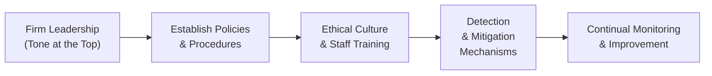
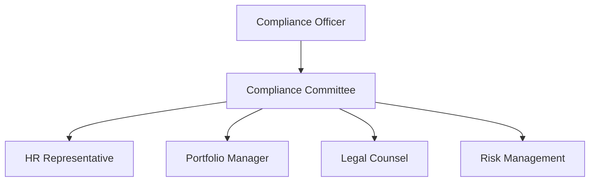

## Introduction

So you’re digging deeper into the Asset Manager Code (AMC), huh? Well, this is where it starts getting real. After all, the entire purpose of the AMC is to encourage ethical and professional behavior across every corner of asset management firms. But how do you actually make those nice‑sounding principles come to life day to day? That’s where firm responsibilities and compliance requirements come in. Let me tell you a quick personal anecdote: In my very first job at a boutique asset management firm, I remember how proud the partners were to say they had adopted a “gold standard” code of conduct. They had these big posters showcasing the Code in the hallway. But truth be told, during my first year there, I sometimes found it challenging to figure out who was actually ensuring we followed those standards—like, was that just the compliance officer’s job? The HR manager’s? The portfolio manager’s? Well, in a strong, well-designed compliance structure, it’s everyone’s job.

This idea is exactly what “Topic 3: Firm Responsibilities and Compliance Requirements” covers. The AMC asks not just for personal integrity but for a robust, institution-wide environment that fosters ethical behavior and keeps misconduct from slipping under the radar. And yeah, that means compliance programs, training, documentation, cross-functional cooperation—basically all the nuts and bolts that keep a firm on track. We’ll walk you through building that environment so you understand both the conceptual side and the very practical day-to-day side.

## Building the Foundation: Ethical Culture and Policies

Let’s face it—if you don’t have a top-level commitment to ethics, no amount of rules or extra training is gonna make a difference. Firm responsibilities under the AMC revolve around establishing a vibrant ethical culture rooted in strong policies and procedures. It’s basically setting the tone at the top, which the firm’s leadership absolutely must champion. I remember a colleague who once said, “If the boss doesn’t walk the walk, forget it,” and I couldn’t agree more. That’s the heart of corporate governance: making sure that the folks in leadership roles take accountability for implementing practices that reflect the Code’s high standards.

Firms adopting the AMC accept organizational responsibility for meeting the required ethical standards. That means:

• Creating policies and procedures that ensure employees know precisely what to do in tricky ethical situations.  
• Providing regular training on the AMC, along with the relevant regulations (like local securities laws).  
• Including systems that quickly detect (and address) misconduct or potential conflicts of interest.

Below is a simple flowchart that outlines how an organization can integrate the AMC into its broader policies:

Notice how each step flows naturally to the next, making the ethical environment a continuous cycle of improvement rather than a one-time fix.

## Setting Up a Compliance Infrastructure

One major reason compliance is so important is that it helps ensure the firm meets not only the AMC’s standards but also all relevant laws and regulations. We’re talking about something systematic here: a formal function that’s staffed by a compliance officer (or even a committee, depending on the size of your firm). Let’s look at a few key components:

• Compliance Officer: This individual is the central hub—responsible for monitoring adherence to policies, investigating potential misconduct, and reporting directly to senior management and/or the board. A strong compliance officer stands up for what’s right, even if that means having some tough conversations with higher-ups.

• Whistleblower Policies: Our emphasis here is on encouraging (and protecting) staff who report ethical or legal violations. Remember, if your employees don’t feel safe reporting wrongdoing, then guess what? They won’t. And that’s exactly how big problems can slip under the radar. In my opinion, no compliance program is complete without a robust whistleblower policy that includes anti-retaliation provisions.

• Ongoing Updates: We all know laws and regulations can change. Heck, entire markets can pivot overnight. Firms must keep an eye on what’s happening in their specific country—or multiple countries if they operate across borders—and update their compliance program as needed. Maintaining flexible policies that can incorporate new rules or best practices is key. The idea is to continually adapt, ensuring that staff is always operating with the best possible guidance at hand.

### Inspiring Confidence with Committees and Dedicated Roles

We sometimes see mid-size and large firms forming “compliance committees.” These committees are composed of cross-functional members (like portfolio managers, research analysts, HR pros, etc.) so that compliance considerations are integrated into each department’s daily workflow. It might seem like overkill if you’re new to the code, but trust me, once your firm grows, having multiple viewpoints on compliance issues is invaluable.  

Picture a typical committee structure:

Each arrow goes both ways in practice, but visually we can see how the Compliance Officer often provides the impetus for policy or concern, while the Committee as a whole discusses the big picture. Then each representative is responsible for ensuring their respective teams follow the Code.

## Code Integration into the Broader Organization

No firm wants conflicting codes. That is, you don’t want your employees to read your corporate Code of Conduct, see one set of guidelines, and then read the AMC to find something else. Integration is essential. Many organizations either rewrite or enhance the entire Code of Conduct to incorporate the AMC’s principles. This ensures consistency—employees see the same set of expectations no matter which internal document they reference.

A few best practices:

• Incorporate the AMC into orientation materials so that all new hires are on the same page as day-one employees.  
• Align disciplinary procedures with the AMC. That is, if someone violates the Code’s standards, the consequences should be clear, fair, and consistent.  
• Identify who is responsible for each policy. For example, the marketing team might be responsible for abiding by certain guidelines around promotional material, while the portfolio management group might handle best-execution practices.  

And yes, that can feel like a lot to manage. But having clearly identified roles and responsibilities actually simplifies life in the long run because everyone knows exactly what’s expected of them. Think of it as labeling all the bins in your storage room: It’s extra effort upfront, but you don’t waste time rummaging later.

## Recordkeeping and Documentation

I can’t emphasize enough how crucial comprehensive recordkeeping is. Remember back in Chapter 2 (Guidance for Standards I–VII), we discussed the importance of documentation in ensuring accountability? That principle is just as relevant here in the AMC. If you didn’t record it, did it really happen? Regulatory bodies often want to see an audit trail. If your firm’s recordkeeping is shoddy or incomplete, it’s a recipe for trouble with regulators and clients—and it undermines your staff’s ability to trust that everything is on the up and up.

Firms adopting the AMC should keep:

• Transaction records (including the rationale for each trade or investment decision).  
• Documentation of any conflict-of-interest disclosures, plus how the conflict was resolved.  
• Internal communications about compliance updates or policy changes.  
• Proof of training sessions—like attendance sheets or digital sign-offs.  

At the same time, be mindful of protecting confidentiality. For instance, if recordings or logs contain sensitive client info, you want to ensure that you’re storing them securely and that only authorized personnel can access them.  

In addition, robust documentation procedures support transparency. When an external auditor or regulator knocks on your door, you can easily hand over relevant documents. Maintaining easily accessible records also helps your staff recall the justification behind critical decisions, which is especially handy if a question pops up months (or years) after the fact.

## Detecting Misconduct Early

We talk a lot about detection, but how exactly do firms detect misconduct before it spirals out of control? Often, it’s a combination of:

• Routine audits (both internal and external).  
• Compliance checklists that employees update regularly—maybe even each morning.  
• Supportive environment for whistleblowing (as mentioned).  
• Real-time or near real-time monitoring software for trading activities.

The earlier you catch an issue, the better. I recall a situation at a previous organization where a mismatch in trade allocations for a handful of accounts was discovered only after a month-end review. By that point, the trades in question had already impacted clients differently. If the firm had been running daily compliance checks, that discrepancy might have been flagged in real-time, preventing losses and potential disciplinary action.  

Another underrated aspect is staff training in how to speak up. Employees often say they’re worried about stepping on toes or being labeled “difficult.” Let them know a real professional is unafraid to do the right thing early, even if it’s challenging. That’s part of building that strong ethical culture we keep talking about.

## Practical Examples and Case Studies

Let’s look at a quick scenario to see how compliance might play out in real life:

• Case: A new star portfolio manager named Alex has been generating strong returns. But you notice Alex is ignoring a key segment of the investment policy statement (IPS) that restricts certain derivatives. He’s not necessarily breaking rules yet, but you see some trades that are borderline.  
• Dilemma: Because Alex is your “all-star,” some folks think, “Let’s just let Alex keep rolling. The performance is excellent.” But that attitude eventually leads to bigger breaches of the Code if not addressed.  
• Action: A well-structured compliance program catches that borderline trade in a routine check. The compliance officer calls Alex in for a chat, clarifies the permissible usage of derivatives, and requires reallocation where necessary.  
• Outcome: This small friction helps Alex stay within guidelines, preserving client trust and the firm’s compliance track record.  

In a less robust compliance environment, those borderline trades might have gone unnoticed for far too long—potentially leading to serious regulatory trouble and reputational damage.

## Common Pitfalls and Potential Challenges

• Lack of Clear Accountability: If no one is designated to monitor certain aspects of compliance, missteps are practically inevitable.  
• Overcomplication: Some firms create compliance manuals so dense that employees never read them. If a guide is too complicated, it effectively doesn’t exist.  
• Inadequate Training: Even the best policies won’t help if employees don’t understand them. Training should be an ongoing, interactive process.  
• Fear of Reprisal: If whistleblower protections are weak, employees are less likely to speak up about questionable practices.

## Strategies to Overcome Issues

• Simplify the compliance manual. Make it user-friendly, with checklists, short bullet points, examples, and reminders.  
• Provide scenario-based training sessions, so employees can practice what they’d do in real-life ethical dilemmas.  
• Empower the compliance function. The compliance officer or team must have the independence and authority to effect serious change—no ifs, ands, or buts.  
• Celebrate positive examples. When employees do the right thing, give them a pat on the back (and maybe a doughnut). It helps build an environment where ethical behavior is recognized and valued.

## Incorporating Technology

I think we’d be remiss not to mention the growing role of technology in complying with the AMC. Automated compliance systems can help track and flag suspicious activity, compile trade data, and even analyze communications for potential red flags. This can be especially helpful where large volumes of trades or large teams are involved.

But technology is no silver bullet. If you rely on algorithms and do not do the good old-fashioned critical thinking or staff oversight, you might miss contextual cues. So the best approach is often a hybrid: advanced technology plus a savvy compliance team that can interpret and act on the data.

## Final Exam Tips

• Familiarize yourself with both the letter and spirit of the AMC. On the CFA Level III exam, you might face a scenario-based question that tests whether you can apply these principles in practice.  
• Remember that compliance is ongoing—you can’t just check a box and say you’re done. The AMC framework evolves alongside markets and regulations, so keep that in mind when responding to case studies.  
• Expect to analyze vignettes where a firm’s compliance environment is tested. Know how to spot red flags: unclear accountability, ambiguous policies, contradictory guidance, or data that suggests inconsistent practices.  
• Watch out for “gray area” scenarios where candidates often struggle. For instance, borderline potential conflicts of interest or situations where a big-money client wields influence. Show that you’d escalate such issues properly under the AMC’s guidelines.

## References and Further Reading

• CFA Institute. (2023). “Guidance for Firms: Implementing the AMC.”  
• OECD. (2015). “G20/OECD Principles of Corporate Governance.”  
• Herz, R. (2019). “Uncovering Risk in Corporate Governance.” Governance Publishing.  

If you want more reading material, I’d recommend diving into older case studies published by the CFA Institute and local regulators. They can shine a light on how different firms interpret and apply these standards. The best way to learn is to see how mistakes happened in the real world—and how they could’ve been prevented.

## Glossary

• Compliance Officer: The go-to individual responsible for making sure everything stays on the ethical straight and narrow.  
• Procedures Manuals: Step-by-step instructions on how to carry out tasks in compliance with internal and external standards.  
• Whistleblower Policy: A set of policies that ensure employees can report unethical or illegal practices without fear of retaliation.  
• Corporate Governance: The system by which a firm is directed and controlled, including the distribution of rights and responsibilities among different participants such as the board, managers, and shareholders.

And that pretty much wraps up our deep dive into firm responsibilities and compliance requirements. From my perspective, having a dynamic compliance and governance system isn’t just for avoiding penalties—it’s a means of building trust with clients and staff. After all, trust is the one intangible factor that sets top-tier asset managers apart from the rest of the crowd.

## Test Your Knowledge: Firm Responsibilities and Compliance Requirements



### Which of the following best describes the role of the Compliance Officer under the AMC?

- [ ] Ensuring maximum turnover for client portfolios.
- [x] Monitoring adherence to the Code and relevant regulations.
- [ ] Setting daily portfolio investment strategies.
- [ ] Promoting higher-risk investment products.

> **Explanation:** The Compliance Officer’s mandate is to oversee all adherence to the AMC and applicable laws. They are not tasked with driving investment decisions or promoting riskier products.

### According to the AMC, which is the most important factor in creating an ethical culture?

- [ ] Automated trade monitoring.
- [ ] Strict rules with harsh penalties.
- [x] Strong tone at the top by firm leadership.
- [ ] Posting guidelines on bulletin boards.

> **Explanation:** While rules and automation help, the single biggest driver is the tone set by top management. Leadership must exemplify and champion ethical behavior.

### In embedding the AMC within a broader corporate code, firms should:

- [x] Align disciplinary actions with the AMC’s provisions.
- [ ] Maintain conflicting guidelines in separate documents.
- [ ] Keep disciplinary guidelines private from employees.
- [ ] Avoid clarifying roles to minimize accountability.

> **Explanation:** Firms should integrate the AMC’s directives into existing codes and ensure disciplinary actions are consistent with the spirit of the AMC.

### What is the primary purpose of whistleblower policies under the AMC?

- [ ] To publicly expose all employee mistakes.
- [ ] To streamline the annual performance review process.
- [ ] To increase organizational top-down control.
- [x] To protect staff who report ethical or regulatory violations.

> **Explanation:** Whistleblower policies create a safe channel for employees to report misconduct without fear of retaliation, thereby encouraging transparency.

### Why are detailed records of conflict-of-interest disclosures crucial for AMC compliance?

- [x] They provide transparency and help demonstrate all conflicts were handled ethically.
- [ ] They allow the marketing team to create targeted ad campaigns.
- [ ] They reduce the need for compliance officers.
- [x] They mitigate legal liability by documenting resolution steps.

> **Explanation:** Proper documentation of conflicts is central to demonstrating ethical conduct and can also help reduce legal risks.

### Which of the following is NOT a best practice for firms adopting the AMC?

- [x] Encouraging employees to bypass the compliance function to save time.
- [ ] Conducting regular compliance training sessions.
- [ ] Establishing a confidential mechanism for employees to report issues.
- [ ] Keeping procedures current with regulatory changes.

> **Explanation:** Bypassing compliance to speed up processes undermines the Code’s standards and is a recipe for misconduct.

### What is one common pitfall for AMC adoption at a growing firm?

- [x] Overly complicated compliance manuals that employees ignore.
- [ ] Comprehensive whistleblower policies and training.
- [ ] Keeping accurate transaction documentation.
- [x] Conducting regular training on updated regulations.

> **Explanation:** A big manual stuffed with complex jargon deters employees from reading and truly understanding the procedures.

### Which statement about compliance committees is correct?

- [ ] They are typically composed of only junior staff to encourage independence.
- [x] They often include cross-functional team members to address diverse compliance issues.
- [ ] They must be chaired by the firm’s top client.
- [ ] They cannot include internal legal counsel due to conflicts of interest.

> **Explanation:** Compliance committees featuring stakeholders from various parts of the organization ensure well-rounded oversight and decision-making.

### How does technology best complement compliance functions?

- [x] By flagging suspicious trades in real-time and assisting staff with data analysis.
- [ ] By completely replacing human oversight and interpretation.
- [ ] By eliminating the need for recordkeeping.
- [ ] By creating personal client portals for entertainment purposes.

> **Explanation:** Technology helps with monitoring, analysis, and recordkeeping, but human oversight remains essential for context and judgment.

### Does the AMC require continuous updates to policies?

- [x] True
- [ ] False

> **Explanation:** Yes. Firms must adapt to changing regulations, market conditions, and best practices to stay in line with the AMC.


