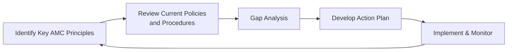

## Introduction and Overview

Let’s say you’re working at a growing investment firm. You’ve got a great track record, your clients trust you, and overall morale is high. Then, in a team meeting, someone says, “Hey, are we really sure our policies measure up to the Asset Manager Code (AMC)?” Suddenly, the room gets quiet. If you’ve ever found yourself in that awkward situation—where you suspect your firm’s day-to-day practices don’t fully match the lofty goals spelled out in the AMC—this section is for you.

Aligning manager practices with the CFA Institute Asset Manager Code is as much about building robust internal processes as it is about fostering a healthy ethical culture. In other words, well, it’s not only about having a fancy manual on the shelf. It’s about weaving the AMC into the very DNA of your firm. This includes checking up on existing policies, bridging any gaps through thoughtful analyses, embedding ethical principles into hiring and performance reviews, and maintaining a steady engagement with all stakeholders—both inside and outside the organization.

Below, we’ll discuss how to identify where your organization already aligns with AMC guidelines, how to conduct gap analyses, and how to ensure that third-party service providers are also on board. We’ll explore practical ways to incorporate AMC principles into investment decision-making, client interactions, and HR. You might even notice a few personal anecdotes sprinkled throughout—because, let’s be honest, implementing ethical codes can sometimes be more complicated than the textbooks make it sound.

## Identifying Existing Policies and AMC Objectives

Before making any big changes, carefully review your current internal policies, controls, and guidelines. The AMC has Six General Principles of Conduct, which revolve around things like acting in the best interest of clients, upholding client confidentiality, ensuring independence and objectivity, and so on. Chances are, your organization already has a handful of documents, from compliance manuals to employee handbooks, that address these areas in some shape or form.

Try focusing on these steps:  
• Gather all relevant documents (compliance manuals, codes of conduct, employee onboarding materials) and map how they compare with each principle of the AMC.  
• Interview key stakeholders (department heads, compliance officers, portfolio managers) for their impressions of how faithfully the existing framework reflects or supports the AMC.  
• Note the differences—both big and small—between your policies and the AMC’s principles.  

I recall a friend who said his firm “didn’t need” a separate AMC policy because their internal code was “basically the same.” When they finally pulled side by side texts, it turned out that they were missing explicit guidelines for third-party vendor oversight. Indeed, thinking you’re compliant and being truly in compliance can be two very different things.

## Conducting Gap Analyses

Once you’ve identified the broad areas where your current policies and guidelines align with the AMC, it’s time to do a more formal gap analysis. Gap analysis is just a fancy way of saying: “Where do we stand now, and where do we need to be to meet AMC requirements?”

In applying gap analysis to align with the AMC, you’ll typically:  
• Outline specific AMC objectives or standards.  
• Compare each standard with relevant internal policies or practices.  
• Categorize each gap (e.g., major, moderate, or minor) based on how significantly it could impact compliance.  
• Set priorities and define next steps.  

Let’s illustrate this visually:

This cyclical approach highlights that aligning manager practices with the AMC is not a one-and-done situation. You’ll keep iterating as regulations evolve, organizational structures shift, and new technologies roll out.

### Potential Action Items for Gap Closure

• Rewrite or revise policies to include more explicit statements on confidentiality, ethical decision-making, and conflict of interest disclosures.  
• Update the compliance training curriculum, focusing on specific AMC principles not already covered in your internal code.  
• Enhance oversight of third-party service providers to ensure they also meet AMC standards (e.g., verifying their conflict-of-interest policies).  

## Ensuring Compliance with Third-Party Collaborations

It’s easy to overlook third-party relationships, right? After all, they’re “outside” your organization. But from the AMC’s perspective, you can’t wash your hands of accountability just because you outsourced certain tasks. If your third-party data provider, for instance, is borderline unethical—say they’re known informally around the industry to be sloppy with reporting—it can reflect poorly on your firm.

To integrate AMC principles with third-party relationships, start by:  
• Conducting thorough due diligence on potential partners (e.g., check their own codes of conduct, compliance track record, and references).  
• Including AMC-aligned clauses in all vendor and third-party contracts.  
• Periodically reviewing third-party performance and compliance certifications.  

That last point is huge. I’ve seen numerous asset management firms that do initial due diligence with gusto, only to “set and forget.” Then two years later, they discover the third party has new ownership, or they changed internal controls in a way that conflicts with the AMC. Regular check-ins can avoid these nasty surprises.

## Integrating AMC Principles in Investment Decision-Making

Ethical considerations shouldn’t feel like an afterthought in your investment processes. The AMC’s “best interest of clients” mantra means going beyond simple portfolio performance. It means thinking about the potential conflicts or ethical pitfalls that might arise in your investment decisions.

### Risk–Return vs. Ethical Mandates

When building or rebalancing a portfolio, your team might consider a standard risk–return assessment, potentially factoring in economic outlook, client preferences, and constraints. But AMC alignment means you also:  
• Evaluate whether any recommended securities or strategies might pose undisclosed conflicts of interest, especially if they are proprietary products.  
• Avoid front-running or trading on material nonpublic information, ensuring you don’t compromise market integrity.  
• Maintain records that prove your investment decisions are guided by objective analysis and the client’s best interest.

### Example: ESG Integration

Suppose your firm is increasingly focusing on environmental, social, and governance (ESG) factors. Aligning AMC guidelines with ESG objectives might involve setting up formal committees to review ESG data, ensuring that those committees have the autonomy to override short-term profit motives if it means upholding ethical standards. You’d want to systematically document how you weigh an investment’s carbon footprint or labor practices against potential returns—making sure your approach meets the spirit of the AMC’s transparency and client-interest requirements.

## Client Reporting and Interaction

Clients deserve honesty, clarity, and respect. That’s basically what the AMC demands when it says you must provide accurate and timely disclosures, promote independence and objectivity, and communicate effectively.

Here are a few best practices for client reporting:  
• Provide performance reports that follow recognized global performance standards (e.g., GIPS), ensuring numbers are calculated and presented consistently.  
• Disclose all material fees and costs upfront, especially performance-based fees.  
• Set a regular schedule for updates (e.g., monthly or quarterly) and promptly communicate any significant changes to investment strategy, staff, or broader market conditions.  

### Illustrative Case

Imagine a scenario: Your client has a long-term investment horizon and specifically requests monthly updates. One month, the portfolio’s performance dips sharply. It can be tempting to “fudge” the explanation or bury it in footnotes. Under the AMC, such obfuscation is a big no-no. Instead, you’d provide a transparent, candid explanation of what occurred, how it’s being addressed, and how it might affect future performance.

## Human Resources Practices

In many ways, institutional culture starts with HR. If your recruitment, onboarding, and evaluation systems don’t reflect AMC values, it’s tough for employees to consistently adhere to them. So how do you tie AMC principles into HR?

### Hiring and Onboarding

• During recruiting, actively look for candidates who demonstrate strong ethical judgment. Even a few simple interview questions that test problem-solving with ethical twists can reveal a lot.  
• Within the first few days on the job, new hires should receive a thorough introduction to the AMC—preferably with real-life scenarios they might encounter.  

### Performance Evaluations

• Incorporate ethical metrics into performance reviews (e.g., measuring how often employees proactively disclose conflicts).  
• Reward behaviors that show adherence to the AMC, not just high profits or large sales volumes. This might mean giving recognition to an employee who raised a red flag on a questionable trade, even if that trade could have been profitable in the short term.

## Ongoing Engagement and Review

Ensuring long-term alignment with the AMC isn’t merely about ticking the box once a year. It’s about constant engagement with employees, stakeholders, and the code itself. Regulations change. The market environment changes. So your ethical practices should adapt.

• Issue regular (semi-annual or quarterly) updates that mention key developments in regulations or updates to the AMC.  
• Have an annual compliance certification system that requires employees to confirm, in writing or electronically, that they understand and abide by your firm’s policies and the AMC.  
• Conduct periodic “fire drills” or scenario tests, where teams are presented with hypothetical ethical dilemmas. This can foster readiness to handle real-world challenges.

## Practical Example: Annual Compliance Sign-Off

An annual compliance sign-off might look like a short online form or a digital module. Employees get a link, review the AMC changes (if any), confirm they’ve read them, and sign off with their electronic signature. This process can be integrated with mandatory training modules, ensuring you bring new hires and transfers up to speed too.

## Best Practices and Common Pitfalls

Below are a few best practices—plus pitfalls you definitely want to avoid:

### Best Practices

• Maintain a central repository of all policies and procedures, easily accessible to employees.  
• Rotate staff across different functions (e.g., compliance, portfolio management, client service) so each team member gains a broader perspective on ethical risk areas.  
• Encourage open-door policies, making it clear that employees can voice ethical concerns without fear of retaliation.

### Pitfalls

• Overlooking intangible signals (like an employee who frequently suggests “borderline” tactics). Such behavior, if not addressed, can snowball.  
• Half-hearted training sessions that fail to engage employees on the “why” behind policies. If your team thinks training is just a checkbox, they won’t retain much.  
• Allowing third-party providers or external collaborators to slip under the compliance radar because “they’re not really us.” Under the AMC, you’re still responsible.

## Putting It All Together: A Quick Recap

It might help to see how these different strands come together in real life. Let’s take a hypothetical scenario:

1. Your firm has a “soft” conflict-of-interest policy that’s missing explicit tracking of gifts or entertainment from vendors.  
2. You do a gap analysis and discover that the AMC explicitly advises disclosing and limiting such gifts to maintain independence.  
3. You update the policy and run a quick training session, providing examples of acceptable and non-acceptable gifts.  
4. You also require each employee to sign an annual compliance certification referencing this new policy.  
5. A month later, someone on your technology team says they’ve been invited on an all-expenses-paid business trip by a vendor prospect. You use this real situation to teach them to politely decline or pay their own way.  
6. At the next compliance review, you check to see that all employees who were offered gifts self-reported them in the designated system.  

This cyclical, iterative process is what will keep your firm truly aligned with the AMC.

## Exam Tips and Key Takeaways

CFA Level III exam questions regarding the AMC often ask you to apply broad ethical principles to scenario-based prompts. You might see a portfolio manager dealing with new client demands, or a compliance officer implementing changes while navigating organizational politics. Be prepared to answer how you would uphold transparency, client confidentiality, objectivity, and so forth.

• Read the scenario carefully and look for subtle signs of potential ethical breaches (e.g., unreported conflicts of interest, incomplete disclosure of fees).  
• Demonstrate not only what the correct action is, but also how you’d communicate that action internally and externally.  
• For essay/constructed-response segments, focus on steps like gap analysis, setting up compliance certifications, or reviewing third-party relationships, as these are common areas of emphasis.  
• Time management is crucial. Outline your main points clearly and concisely.  

## Glossary

• Gap Analysis: A method for comparing your current policies against desired standards or goals, identifying where changes are needed.  
• Due Diligence: Detailed examination of processes, third parties, or transactions to confirm compliance and ethical integrity.  
• Annual Compliance Certification: A practice requiring employees to attest—often once a year—that they understand and adhere to the code.

## References and Further Reading

• CFA Institute. (2022). “Case Studies on Integrating the AMC into Firm Culture.”  
• Tipler, F., & Chiang, J. (2020). “Ethical Business Process Review.” Global Finance Journal.  
• Additional Note: For a deeper look at building robust compliance processes, consider reviewing the Global Investment Performance Standards (GIPS) and associated manuals from the CFA Institute.  

## Test Your Knowledge: Aligning Manager Practices with the AMC



### When conducting a gap analysis for AMC alignment, which activity is most critical?

- [x] Systematically comparing each AMC principle to existing internal procedures.
- [ ] Ensuring investment returns exceed a prespecified threshold.
- [ ] Dividing staff into smaller teams to handle different client segments.
- [ ] Relying on a single compliance officer’s opinion alone.

> **Explanation:** A formal, systematic comparison of AMC principles with current practices is essential for identifying, prioritizing, and fixing gaps.

### Which of the following best illustrates effective integration of the AMC in investment decision-making?

- [x] Requiring portfolio managers to document their research assumptions and any potential conflicts of interest.
- [ ] Permitting portfolio managers to use material nonpublic information if it benefits large clients.
- [ ] Encouraging front-running trades when market conditions are favorable.
- [ ] Allowing discretionary trading without formal oversight for senior managers only.

> **Explanation:** The AMC mandates transparent, objective analysis of investment decisions and prompt disclosure of potential conflicts.

### In aligning with the AMC, why is it important to consider third-party service providers?

- [x] Because managers remain responsible for ethical breaches that occur within outsourced operations.
- [ ] Third-party providers can use AMC compliance to charge premium fees.
- [ ] External collaborations are not covered by the AMC.
- [ ] Providers do not need oversight if they sign a confidentiality agreement.

> **Explanation:** Outsourcing doesn’t shield you from ethical obligations. The AMC makes it clear that you must ensure third parties also uphold ethical standards.

### Which HR practice best supports an AMC-driven culture?

- [x] Evaluating employees based on ethical behavior, not just revenue generation.
- [ ] Rewarding only the top revenue-generators, regardless of their methods.
- [ ] Conducting ethics training only for new hires.
- [ ] Disclosing employee performance reviews to clients.

> **Explanation:** When employee appraisals incorporate ethical considerations, the firm aligns better with AMC values.

### A client complains about opaque fee structures. To maintain AMC compliance, your firm should:

- [x] Provide clear disclosures on all fees and how they are calculated.
- [ ] Delay responding to the query until the next reporting cycle.
- [x] Offer a revised statement that details each fee, including performance incentives.
- [ ] Remove certain fees to avoid client scrutiny.

> **Explanation:** The AMC mandates transparency and timely disclosure of fees. Providing an itemized breakdown supports these principles.

### What is a key element of an annual compliance certification?

- [x] Each employee reaffirms adherence to AMC-aligned policies.
- [ ] A single signature by the firm’s compliance officer verifies everyone’s compliance.
- [ ] Asset managers only sign it upon joining the firm, not annually.
- [ ] No mention of changes in the firm’s policies or procedures.

> **Explanation:** An annual certification process ensures every professional understands updates to the AMC and remains accountable.

### Which of the following tactics is NOT advised when integrating AMC guidelines?

- [x] Restricting open communication to avoid discovering ethical issues.
- [ ] Regularly updating the firm’s policies to reflect new regulations.
- [x] Keeping employees informed about changes through periodic training sessions.
- [ ] Including codes of conduct clauses in third-party agreements.

> **Explanation:** Avoiding communication in hopes of dodging ethical issues is detrimental to AMC alignment. Open communication is crucial for ongoing compliance.

### What is a recommended approach to handle a conflict of interest discovered during investment selection?

- [x] Promptly disclose the conflict and take measures to maintain independence and objectivity.
- [ ] Keep it private to protect firm interests.
- [ ] Proceed with the investment without disclosing it, as long as it’s profitable.
- [ ] Only disclose it if the client specifically inquires.

> **Explanation:** Transparency and timely disclosure are cornerstones of the AMC. Hiding conflicts undermines ethical standards.

### How can gap analysis lead to continuous improvement in AMC alignment?

- [x] By regularly iterating the process, new issues are identified and policies are refined over time.
- [ ] By finalizing a one-time comprehensive report that doesn’t need updating.
- [ ] By focusing solely on financial performance metrics.
- [ ] By deferring the review process to external auditors only.

> **Explanation:** Continuous re-examination (iterative approach) is key to maintaining alignment with evolving standards, technology, and market conditions.

### True or False: Firms that have an internal code of conduct automatically comply with the AMC.

- [x] True
- [ ] False

> **Explanation:** Actually, this statement is often incorrect in practice. While an internal code might cover some similar principles, full AMC compliance often requires specific provisions, explicit disclosures, and processes that might not be captured by a generic internal code. One must confirm each AMC principle is fully addressed.


