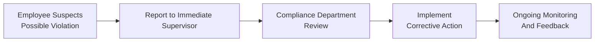

Pre-emptive policies are often the first line of defense in preventing ethical and compliance violations within asset management firms. If you’ve ever tried to drive uphill in a car with no brakes—well, that’s sort of what it feels like to manage client assets without robust ethical guidelines. You can accelerate forward, but sooner or later, you might have a hard time stopping if something goes wrong. So the idea here is to ensure the “brakes” are in place before the slopes get slippery.

These recommended practices function as the bedrock of a firm’s culture, aligning daily decisions with the Asset Manager Code of Professional Conduct and the broader CFA Institute Standards. Let’s explore some practical steps (and a handful of personal anecdotes) that can help you gently steer your organization away from trouble—and swiftly address any issues that do arise.

## Pre-Emptive Policies

Effective pre-emptive policies revolve around clearly documented conflict-of-interest guidelines, gift/entertainment rules, and procedures requiring supervisory sign-off for potentially tricky client requests. A friend once confided in me that she was tempted to accept generous hospitality from a client—a yacht trip off the coast of Italy. Sounds amazing, right? But from a compliance perspective, that can be a red flag for undue influence or hidden quid pro quos. Pre-emptive policies step in here, making it crystal clear to employees what is and isn’t permissible.

▶ Conflict-of-Interest Policies  
• These policies explain how employees should recognize and manage conflicting priorities—such as choosing between a fund’s best interest and the firm’s own gain, or between the client’s objectives and personal compensation structures.  
• They often require employees to disclose personal holdings, outside business interests, or family relationships that could sway professional judgment.

▶ Supervisory Sign-Off for Unusual Trades  
• A second set of eyes never hurt anyone. For instance, large or illiquid trades might need supervisor clearance to ensure alignment with the client’s investment mandate, especially if the request looks unusual.  
• This sign-off also serves as an educational opportunity: junior portfolio managers get to understand the rationale behind either approving or rejecting certain actions.

## Risk-Based Monitoring

We all know that not every scenario carries the same level of regulatory or ethical risk. Time constraints and staff capacity are often limited, so focusing your compliance resources on the highest-risk areas just makes practical sense. For instance, side letters that promise preferential treatment to certain clients can be particularly hazardous since they risk creating an uneven playing field. If you monitor higher-risk scenarios more closely, you’re more likely to catch problems early—before they blow up into a major reputational fiasco.

▶ Identifying High-Risk Transactions  
• Keep an eye on side-by-side management (simultaneously managing mutual funds and hedge funds, for example). A manager might be tempted to allocate more lucrative opportunities to the higher-fee product.  
• Cross trades, personal account trades, and trades executed in illiquid securities also raise concerns due to potential front-running or price manipulation.

▶ Ongoing Training  
• It’s not enough to publish a static policy manual that collects dust on a shelf. Periodic compliance training is essential so employees feel confident identifying potential risks.  
• Associate this training with real examples: show how conflicts might lurk in managing complex instruments or how ignoring certain disclosures can land the firm in hot water.

## Operational and Technological Tools

Let’s face it: you can’t manually keep track of every single trade at a rapidly growing asset management firm. Thankfully, technology solutions can do some of the heavy lifting. There are automated systems that can detect unusual trading volumes, suspicious patterns, or repeated errors. A good friend in operations once marveled at how quickly an automated system flagged trades that suspiciously moved just ahead of market-moving announcements. It saved her firm from what could have become a possible insider trading investigation.

▶ Automated Trade Surveillance  
• Software for real-time transaction monitoring can highlight anomalies, such as buy orders placed shortly before key earnings news.  
• Logs and alerts provide important data for compliance teams to examine and evaluate, ensuring quick corrective action.

▶ Robust Record Maintenance  
• Let’s not forget email and chat-archiving tools that capture employee communications. If the regulator knocks on your door, systematic record-keeping gives a transparent trail of activity.  
• Modern archiving platforms also allow advanced text analytics, which can clue you in to phrases or patterns that signal potential wrongdoing (“tip,” “hush,” etc.).

## Escalation and Resolution Protocols

Sometimes employees hesitate to speak up because they’re not sure who to talk to—or what might happen to them for reporting a problem. A robust escalation protocol clarifies the chain of command and fosters an atmosphere of trust. Ultimately, it’s about making it easy to raise a concern: no one should have to guess whether to tell their manager, their manager’s manager, or the person on the other side of the building.

Below is a simple mermaid diagram demonstrating a typical escalation flow:

▶ Clear Chain of Command  
• Document who is responsible for each step, from initial reporting to final resolution.  
• Outline specific timelines. For instance, a firm might require the immediate supervisor to respond within 24 hours and the compliance department to set up a formal review within 72 hours.

▶ Detailed Resolution Logs  
• You don’t want to rely on memory if regulators come calling a year later. Document every stage—who reported the violation, who observed it, what was decided, and how the situation was remedied.  
• The logs can also be aggregated for root cause analysis. If multiple incidents point to the same operational gap, you might consider strengthening that area of compliance.

## Integrating Policy with Firm Culture

Preventing and mitigating violations ultimately relies on more than just a thick binder of rules. A strong ethical culture is that intangible “vibe” or environment that nudges everyone toward doing the right thing. Culture is like the background music in a store: it sets the tone, impacts mood, and can subtly shape behavior. When employees see visible, consistent support from leadership—folks who walk the talk rather than ignoring their own guidelines—compliance becomes second nature for the entire team.

## A Word on Multi-Jurisdictional Firms

Many asset managers operate across national borders, juggling a mosaic of local regulations. It’s not uncommon for something that’s legal in one country to be frowned upon in another. That’s why a risk-based approach aligned with your global compliance framework should factor in each jurisdiction’s unique requirements. Don’t expect a single, one-size-fits-all policy to address every cultural or regulatory nuance. Instead, local compliance officers familiar with each region’s norms can adapt global procedures to local contexts.

## Common Pitfalls

• Having guidelines but no practical enforcement. If employees see no follow-up, the guidelines become meaningless.
• Overly complex compliance systems that intimidate employees. If they’re too cumbersome, folks skirt them or keep quiet.
• Inadequate training for new hires, especially among junior staff who might be unaware of the real-world consequences.

## Exam Relevance for CFA Level III

Ethics questions at Level III usually show up as scenario-based case studies. You might see a portfolio manager grappling with a potential conflict where an institutional client demands preferential terms, or an analyst who’s offered advanced notice of corporate earnings. You’ll typically need to decide the best course of action for each scenario and tie your reasoning to the Code and Standards or, in this volume, to the Asset Manager Code. Mastering these recommended practices for preventing and mitigating violations isn’t just about passing an exam—though, let’s be honest, that’s pretty important—it also helps you cultivate a robust ethical foundation for your daily work in finance.

## Practical Example: Personal Trading Gone Wrong

Imagine you have a research analyst who invests personally in a small biotech firm right before issuing a “buy” recommendation to the firm’s client base. Later, the biotech’s stock price jumps, and regulators suspect insider knowledge. Because your firm lacked a robust pre-clearance policy for personal trades, it was only after the fact that compliance discovered the conflict. As you might guess, the firm faces regulatory scrutiny and potential sanctions, not to mention reputational damage.

How could this have been averted? A robust conflict-of-interest policy plus automated monitoring of personal trades would have flagged the purchase before the note was published. Even better, training might have prevented the individual from taking the risky action in the first place.

## Glossary

Conflict-of-Interest Policy  
An internal document outlining how to recognize, disclose, and mitigate misaligned interests. Helps set a clear boundary between professional and personal incentives.

Supervisory Sign-Off  
A requirement that certain trades or client instructions get approval from a more senior manager or compliance officer. Serves as a fail-safe against hasty or potentially unethical decisions.

High-Risk Transactions  
Trades or decisions deemed more prone to violations or misunderstandings. Examples include crossing trades, side-by-side management, or large trades in illiquid markets.

Escalation Procedure  
A systematic, step-by-step guideline for reporting a potential policy breach. Defines who to notify and when, ensuring issues reach the right people quickly.

## References and Further Reading

• Choi, S., & Pritchard, A. (2019). “Securities Regulation: Cases and Materials.” Aspen Publishers.  
• Di Lorenzo, V. (2018). “Preventing Employee Misconduct: Designing Effective Compliance Programs.” Corporate Compliance Press.  

## Final Exam Tips

• Always tie your reasoning to a stated policy or standard. Don’t just say “it’s unethical”; explain why it violates the Asset Manager Code or conflicts with a known best practice.  
• Familiarize yourself with real-world applications. Think about how a firm’s organizational structure might inhibit or facilitate the reporting process.  
• Keep an eye out for “trick” scenarios where the immediate wrongdoing might be subtle—for example, an overlooked side letter that grants certain clients special trading privileges or additional disclosure.  
• Time management remains key: read each ethics case thoroughly and note the key players involved, the relevant standard(s), and the recommended course of action.

By combining pre-emptive policies, risk-based monitoring, technological tools, and transparent escalation structures, asset managers are far better placed to prevent or mitigate violations—protecting not only their own reputation but also the integrity of the broader financial industry. And trust me, you really don’t want to be the person in the compliance hot seat discussing a major scandal with regulators, so be proactive, train regularly, and keep those eyes wide open.

---

## Test Your Knowledge: Preventing and Mitigating Violations in Asset Management



### A portfolio manager is offered an all-expenses-paid trip to a luxury resort by a potential client. Which practice best helps prevent an ethical conflict in this scenario?

- [ ] Relying on the manager’s personal judgment.
- [ ] Having no policy and deciding ad hoc.
- [x] Maintaining a conflict-of-interest policy that specifies acceptable limits.
- [ ] Allowing unreported acceptance of gifts.

> **Explanation:** A conflict-of-interest policy clarifies what is and is not acceptable in terms of gifts and entertainment, helping portfolio managers avoid situations that compromise their objectivity.

### Which of the following trades is typically considered “high-risk” and warrants additional review?

- [x] Illiquid trades executed for personal accounts.
- [ ] Day trades in highly liquid, large-cap stocks.
- [x] Cross trades between client portfolios managed by the same firm.
- [ ] Block trades in well-known index funds.

> **Explanation:** Illiquid trades in personal accounts and cross trades between client portfolios are more prone to conflicts or mispricing. Large-cap stocks and standard index trades are generally less risky (though still worth monitoring).

### In a risk-based monitoring system, which approach is most efficient?

- [x] Focusing compliance resources on areas with a higher probability of violations.
- [ ] Distributing compliance resources equally across all departments.
- [ ] Implementing random spot checks only.
- [ ] Outsourcing all compliance tasks to an external consultant.

> **Explanation:** Concentrating on high-risk areas (like side letters) allows compliance teams to use their resources effectively, minimizing the likelihood and impact of violations.

### What is the primary purpose of maintaining detailed escalation and resolution logs?

- [ ] To shield upper management from accountability.
- [ ] To eliminate the need for training.
- [ ] To reward employees who discover violations with bonuses.
- [x] To document each stage of the reporting and resolution process for accountability.

> **Explanation:** Escalation logs create a paper trail to show how violations are handled, ensuring accountability and transparency, which is crucial if regulators or auditors request a review.

### A compliance officer discovers repeated conflicts in side-by-side management. Which method is most aligned with recommended practices?

- [x] Implementing supervisory sign-offs for trades in funds with overlapping strategies.
- [ ] Halting all trades indefinitely until further notice.
- [x] Requiring more rigorous disclosures for managers handling both portfolios.
- [ ] Relying solely on employees’ integrity.

> **Explanation:** Supervisory sign-offs and additional disclosures offer structured oversight. Halting trades completely may be extreme, and trust alone is insufficient without controls.

### Which example best illustrates a low-risk trade?

- [x] A sale of a small position in a major index ETF for a retirement account.
- [ ] A large block trade in a thinly traded corporate bond with restricted liquidity.
- [ ] A personal stock purchase secured through privileged, non-public info.
- [ ] A side-letter arrangement granting special fee reductions to an insider.

> **Explanation:** Selling a small position in a well-known index product is generally lower risk compared to trades in illiquid assets or those conveying special privileges.

### How does training junior employees on compliance practices benefit a firm?

- [x] Ensures they detect and report ethical conflicts effectively.
- [ ] Eliminates the firm’s need for advanced surveillance systems.
- [x] Encourages a culture where policy awareness is widespread.
- [ ] Allows them to handle complex trades without oversight.

> **Explanation:** Training fosters awareness and helps employees understand their responsibilities. Surveillance systems are still necessary, but training is a vital supplement.

### In which situation is supervisory sign-off most useful?

- [x] When executing client trades that deviate from standard investment guidelines.
- [ ] When an employee invests in widely held index funds.
- [ ] For basic administrative tasks like filing or scanning documents.
- [ ] For publicly known corporate news announcements.

> **Explanation:** Supervisory sign-off is particularly important for trades that do not align with the usual strategy, helping ensure ethical lapses do not occur.

### Why might a firm consider advanced text analytics for email and instant messages?

- [x] To detect potential misconduct or suspicious communication patterns.
- [ ] To outsource the compliance function entirely.
- [ ] To generate marketing material automatically.
- [ ] To replace the need for staff training.

> **Explanation:** Text analytics can catch early signs of misconduct but doesn’t replace human judgment or training. It complements a firm’s compliance oversight.

### An asset manager with offices in multiple countries modifies its global code to align with local requirements. Is this recommended?

- [x] True
- [ ] False

> **Explanation:** Firms operating in multiple jurisdictions should adapt policies to local regulations while maintaining core ethical standards. A one-size-fits-all code might overlook specific regional rules.


