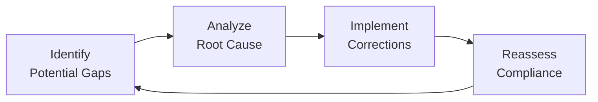

## Introduction

Assessing compliance against the Asset Manager Code (AMC) in the real world can sometimes feel like trying to hit a moving target—regulations evolve, market conditions shift, and employees come and go. But it’s precisely because of these changes that a robust and adaptable compliance structure is so important. In my previous role setting up compliance frameworks for a boutique fund, I quickly realized that a theoretical approach—where you just check boxes—only gets you so far. You need to test your code in real-life scenarios, see how people and processes actually respond under stress, and then adapt accordingly.  

This topic explores practical ways to evaluate your firm’s adherence to ethical and professional conduct standards, how to prepare for the unexpected, and how to keep learning from actual incidents (both your own and those of other organizations). We’ll talk about case study evaluations, formal audits, key metrics, and the importance of learning from slip-ups or near-misses. Throughout, we’ll connect these ideas back to the specific requirements and best-practice guidelines in the AMC.  

## Case Study Evaluations

Case studies bring you face-to-face with real or hypothetical compliance situations that test a firm’s ethical defenses. Reviewing incidents—like a portfolio manager front-running client trades or a mid-level associate ignoring an obvious conflict of interest—often reveals hidden vulnerabilities long before regulators come knocking.  

It’s one thing to say “We have a policy prohibiting personal trading that conflicts with client interests.” It’s quite another to see how that policy holds up when, for instance, you discover someone was day-trading a stock on their phone or, frankly, “borrowing” client ideas for their personal portfolio.  

Case Study Approach:  
• Select relevant scenarios that mirror your business model. A large institutional asset manager might choose to test different scenarios than a smaller wealth advisory shop.  
• Challenge each element of your compliance chain, from how employees are trained to how technology helps (or hinders) transparency.  
• Evaluate the preparedness of managers in responding to near-miss events. For example, if a compliance officer identifies suspicious trades in a client’s account, do you have a clear escalation process? Is it documented?  

By dissecting everything that went right and wrong in these examples, you become more aware of hidden angles, potential conflicts of interest, and the real motivations of employees, counterparties, or even clients themselves.  

### Practical Illustration

Let’s say a hypothetical firm, Granite Investments, discovered an unanticipated market shock that led to intense redemption requests. Portfolio managers needed to offload illiquid securities quickly. A compliance gap arose because the policy on how to handle forced selling during market stress wasn’t robust. The firm’s code demanded that no client be unfairly disadvantaged, yet in practice, some clients with specialized mandates were partly sidelined. This near-miss highlighted the need for scenario testing around liquidity protocols and triggered a deeper conversation on fairness across the board.  

Notice how a single scenario can open the door to myriad compliance issues—from data privacy (suddenly bigger lists of sensitive holdings get circulated) to conflict-of-interest concerns (who gets sold out first?).  

## Compliance Audits and Testing

While case studies give you great “what ifs,” formal compliance audits are the real litmus test for how effectively your company’s day-to-day processes align with the AMC. Audits can be done either by your own internal audit function, an external consulting firm, or sometimes (less ideally) after an enforcement agency has come knocking.  

### Internal vs. External Audits

• Internal Audits:  
  – Pros: Typically more cost-effective, fosters close collaboration between departments, easier to schedule.  
  – Cons: Potential biases or blind spots, especially if the internal auditors have close personal or professional relationships with the teams they’re auditing.  

• External Audits:  
  – Pros: More objective, often have broader industry exposure, can benchmark you against similar firms.  
  – Cons: Costly, and scheduling or information-sharing can become cumbersome if not well planned.  

### Elements of a Compliance Audit

• Documentation Review: Include the firm’s code, investment policies, training materials, sample client interactions, and marketing documents.  
• Staff Interviews: A quick chat with employees can sometimes reveal more about the firm’s alignment with ethical principles than hundreds of pages of policy statements.  
• Testing Protocols: Conduct spot checks or “mystery shopper” tests on processes like trade approvals, expense reimbursements, or client data protection.  
• Assessment of Resources: Evaluate whether you have enough compliance specialists, technology support, and training programs to address risk.  

I was once in a situation—this was at a mid-size asset management firm—where the external auditors arrived the same week we lost a key compliance manager to a better offer across town. Talk about comedic timing. But interestingly, that test made us realize we didn’t have a proper backup plan. We had the policies, but not the people. Downsizing or reassigning staff in a crucial area can create blind spots, so keep an eye on resource allocation at every stage of your compliance program.  

## Metrics and KPIs

Tracking compliance is more than just a yes/no proposition. Key Performance Indicators (KPIs) help evaluate your firm’s track record over time, spot emerging problems, and showcase improvements.  

Some common metrics might include:  
• Frequency of Compliance Incidents: Are events or breaches dropping or rising each quarter?  
• Time to Resolution: How long does it typically take from identifying an issue to final resolution?  
• Number of Client Complaints: Where’s the trend heading? If complaints spike, is there a new product launch or staff turnover situation that might be contributing?  
• Training Completion Rates: How many employees have done annual ethical conduct refreshers, and with what quality results?  
• Internal Audit Findings: Tally the classification (e.g., high/medium/low risk) and keep an eye on repeated issues.  

### Using a Formula for Compliance Ratios

In practice, you might assess compliance as a ratio of successful checks to total checks. For instance:


\text{Compliance Ratio} \;=\; \frac{\text{Number of Successful Policy Adherences}}{\text{Total Number of Checked Policy Points}}


A high ratio indicates strong adherence, but you might still explore the “why” behind any deviations. Let’s say your ratio is 90% but that 10% non-compliance is happening in a particularly critical area—like front-running or conflict of interest disclosures. That’s a big deal, even if the overall ratio seems high.  

Below is a simple table illustrating a hypothetical compliance summary over three quarters:

| Metric                              | Q1  | Q2  | Q3  |
|-------------------------------------|-----|-----|-----|
| Number of Reportable Incidents      | 5   | 3   | 4   |
| Training Completion Rate (%)        | 85  | 92  | 95  |
| Time to Resolution (days, average)  | 14  | 10  | 8   |
| Client Complaints                   | 2   | 1   | 3   |
| Compliance Ratio (%)                | 88  | 91  | 90  |

Just from this, you can start spotting trends—fewer incidents in Q2 but then a small uptick in Q3, or improvement in employee training and faster resolution times.  

## After-Action Reviews

Even the best-laid compliance plans can go awry. And when they do, you can treat it like a problem or as an opportunity to get better. After-action reviews (AARs) are your chance to learn, regroup, and revise—and they don’t solely apply to actual violations. They’re incredibly helpful for near-misses too.  

### Conducting an AAR

• Gather Relevant Players: Include the compliance officer, team leads, and any staff member directly involved in the event or near-event.  
• Sort Out the Timeline: Reconstruct what happened, including who was involved, which policies might have been unclear, and how the incident was identified.  
• Perform Root Cause Analysis:  
  – Dig deeper than the “proximate cause.”  
  – Identify systemic issues, such as inadequate training or misaligned incentives, that might have contributed.  
• Propose Action Items: Update guidelines, revamp training materials, or implement new oversight.  

This kind of “lessons learned” process is particularly valuable because it’s so easy to say, “We dodged a bullet—let’s just move on.” But ignoring near-misses means you’ll probably fail to recognize patterns that might cause bigger problems down the line.  

Let’s visualize the typical compliance improvement cycle using a Mermaid diagram:

This perpetual loop ensures that once you spot a weak point, you fix it, test it, and reinforce it for the future.  

## Practical Implementation and Real-World Examples

Sometimes it helps to see how everything pulls together in actual practice. Imagine you’re the chief compliance officer at a mid-tier portfolio management firm:

• You decide to run quarterly scenario analyses for potential compliance flashpoints—like unauthorized trade allocations or misrepresentation in marketing materials.  
• Meanwhile, your external auditors check your controls, interview staff, and produce a set of improvement recommendations.  
• You keep an eye on KPIs such as staff training scores, time taken to close compliance issues, and external complaint logs.  
• One day, you discover a near-violation: an associate tweeted about a confidential client trade while attending a networking event. You conduct an after-action review, figure out that your social media policies aren’t well-communicated, and refine your training modules.  

Over time, you build a robust environment where compliance is second nature and even “almost-incidents” become less and less likely.  

## Glossary

Compliance Audit: A comprehensive review of policies, procedures, records, and controls related to ethical and legal standards. Audits test whether a firm’s actual day-to-day processes align with the policies stated in the AMC and other regulatory frameworks.  

Scenario Analysis: A testing technique in which a firm imagines and prepares for theoretical (often extreme) events to evaluate whether staff, policies, and controls would hold up under pressure.  

Key Performance Indicators (KPIs): Quantifiable measures used to evaluate success in meeting ethical, regulatory, or operational targets. They help you track and benchmark your compliance program over time.  

Root Cause Analysis: An investigative process to pinpoint the deeper reasons an issue or incident occurred. Instead of settling for superficial explanations, you ask “Why?” repeatedly to uncover systemic factors.  

## References and Further Reading

• Bartman, Q. (2021). “Effective Compliance Testing: A Practitioner’s Guide.” Ethical Practice Review.  
• CFA Institute. (2021). “Insights from Regulatory Enforcement Actions: Lessons for Asset Managers.”  
• Glover, R. (2020). “Scenario Analysis Best Practices in Financial Services.” Journal of Risk Management.  

## Exam Tips

• Expect scenario-based questions that ask you to apply concepts of the Asset Manager Code to real cases. You might see a mini-case describing potential wrongdoing, and you’ll have to identify violations and propose next steps.  
• For essay (constructed response) questions, clearly outline your thought process: how you’d investigate, which metrics you’d examine, and how you might prevent recurrence.  
• Be prepared to discuss both internal and external audits—pros and cons—and how you’d select the appropriate approach in a given scenario.  
• Use the knowledge gained through root cause analysis in your tests. It’s not just about identifying the surface-level issue but also explaining how you’d address the deeper, underlying problem.  

## Test Your Knowledge: Assessing AMC Compliance in Real‑World Scenarios



### A chief compliance officer wants to test how employees respond to extreme liquidity events. Which approach is most relevant?

- [ ] Compliance audit by external auditors only
- [ ] Calculation of a new compliance ratio
- [x] Scenario analysis focusing on forced redemptions
- [ ] Benchmarking incentive structures

> **Explanation:** Scenario analysis helps simulate reactions to abnormal or extreme market conditions, revealing how prepared the firm is to handle liquidity stress.

### During an internal audit, you identify multiple front-office staff who are unsure how to escalate compliance red flags. Further investigation shows that only 50% have completed training. Which short-term KPI is most relevant?

- [ ] Time to resolution of past compliance incidents
- [x] Training completion rate
- [ ] Number of client complaints
- [ ] Firmwide compliance ratio for the year

> **Explanation:** Because the audit shows a direct gap in training adherence, the most relevant metric to address immediately is the training completion rate.

### Which description best characterizes a root cause analysis?

- [ ] A daily performance review of portfolio returns
- [x] An in-depth process that investigates underlying reasons for a violation
- [ ] A measure of new client onboardings
- [ ] A routine IT system security check

> **Explanation:** Root cause analysis pinpoints the deeper, underlying factors behind a violation or near-violation, not just the immediate problem.

### A firm sees an uptick in potential compliance breaches right after doubling its product lineup. Which is a prudent step?

- [x] Conducting a case study evaluation on newly introduced products
- [ ] Penalizing the marketing team immediately
- [ ] Suspending product distribution network
- [ ] Withdrawing from all new product areas

> **Explanation:** A careful case study evaluation for each new product can reveal hidden compliance risks and help refine policies before punitive measures are taken.

### An external consultant identifies that while your compliance policy looks great on paper, the firm has insufficient tech resources to monitor trades. How should you respond?

- [x] Update resource allocation and invest in new technology tools
- [ ] Rely on staff self-reporting trades
- [ ] Place a moratorium on all new trades
- [ ] Cancel future external audits

> **Explanation:** A strong written policy isn’t enough if you lack the back-end infrastructure to maintain or track compliance. Investing in the needed tech resources is key.

### What is an immediate benefit of conducting an after-action review for a near-miss event?

- [x] Identifying systemic or procedural flaws before an actual violation occurs
- [ ] Shutting down the relevant product line
- [ ] Publicly disclosing the near-miss to all clients
- [ ] Eliminating all compliance training sessions

> **Explanation:** After-action reviews let organizations spot and fix issues uncovered by near-misses, preventing more serious violations down the road.

### Time to resolution is a KPI that can indicate:

- [ ] The total number of employees
- [x] How quickly a firm can address compliance breaches
- [ ] The total assets under management
- [x] Whether compliance errors frequently reoccur

> **Explanation:** Time to resolution measures how fast breaches are identified, escalated, and resolved. Tracking repeated errors over time can also reveal if solutions are truly effective.

### A scenario analysis indicates a loophole in how employees handle conflicts of interest. What is the appropriate next step?

- [x] Implement improvements and then retest
- [ ] Immediately terminate any employee in that department
- [ ] Reduce the training budget since the issue is now identified
- [ ] Ignore it unless a breach actually occurs

> **Explanation:** Identifying a loophole means the firm should implement changes and test (or retest) the updated procedures to ensure the gap is closed.

### Which of the following metrics might be most helpful in identifying a breakdown in communication between compliance officers and staff?

- [ ] Client retention rate
- [ ] Sharpe ratio or other performance metrics
- [x] Number of staff inquiries or clarifications requested
- [ ] Percentage of budget allocated to marketing

> **Explanation:** A high volume of staff inquiries (or a lack thereof) can suggest either confusion or poor communication between compliance officers and employees.

### True or False: A robust after-action review attempts to fix only the immediate cause of the compliance breach.

- [x] True
- [ ] False

> **Explanation:** While after-action reviews do address the immediate cause, a truly robust approach also digs deeper into any underlying systemic issues to prevent future recurrences.


