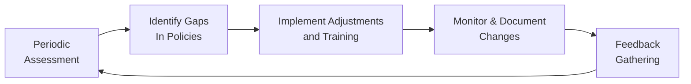

## Introduction

I remember sitting down with a friend who was new to compliance at a small asset management firm. She was a little nervous about launching a “Periodic Review” process—she had so many questions. Where to start? How often to review everything? What if they missed something? You know, the usual anxieties. That conversation led me to realize how central and, frankly, how reassuring a structured review process can be for ethical compliance. Conducting periodic reviews is like giving your firm a regular health check. If you do them well, you get clarity on where your compliance posture stands, what needs fine-tuning, and how you can stay on track with all relevant regulations—especially under the Asset Manager Code (AMC).

These reviews aren’t simply “nice to do.” They’re crucial for continuously aligning management practices with the standards outlined in the AMC. This includes making sure you’re hitting all the key points involving client interests, transparency, risk controls, and everything else that keeps your firm’s ethical engines running smoothly. Let’s explore how to plan and execute these reviews, plus we’ll look at ways to involve both internal and external stakeholders, and how to maintain an ongoing improvement loop.

## The Importance of Periodic Reviews

Periodic reviews are designed to promote consistency and continuous compliance. The AMC offers a robust framework to guide managers toward ethical, transparent, and client-focused behavior. But even the best policies and procedures can become stale if they’re left unexamined. Markets evolve, client requirements shift, and the regulatory environment changes.

• Avoiding complacency: A well-run periodic review ensures that your firm doesn’t just assume everything is fine.  
• Capturing changes over time: Business models adapt to new market conditions, so your compliance process must adapt too.  
• Identifying potential blind spots: Sometimes new regulations or best practice standards might slip through the cracks if your checks only happen sporadically.  

## Key Components of Periodic Reviews

### Scheduled Internal Assessments

Many firms perform internal assessments annually, but if your business is complex or fast-evolving, you might consider semi-annual or quarterly reviews. Think of these as an internal “clean-up day.” You comb through everything—policies, procedures, training modules, even your staff’s daily processes—and you spot any dust bunnies hiding in the corners.

In my opinion, the best place to start is with your compliance manual. Are all the procedures up to date with the current rules? Are employees trained on the newest versions of those rules? Is everyone crystal clear on their responsibilities? Also, it’s good to keep an eye on business model changes. Have you added a new product line, distribution channel, or partnership that might require additional compliance checks?

#### Example: 
If your firm originally specialized in equities and recently branched into alternative investments, you may need adjustments in disclosures, risk exposures, or even compliance staff expertise. That’s when an internal assessment can immediately spot misalignments before they become big compliance headaches.

### External or Third-Party Verification

Well, it’s one thing to verify your own compliance posture, but let’s be real—sometimes we get too used to our systems, and potential issues slip by. That’s why the AMC strongly encourages external or third-party verification. By engaging an independent consultant, auditor, or law firm specializing in asset management regulations, you gain an unbiased perspective on your reviews.

External consultants can confirm your internal assessment or reveal discrepancies. And, good news: an external verification can enhance your firm’s credibility. Clients and stakeholders often feel more confident when an objective expert has looked over your procedures and given the thumbs-up.

#### Case Study:
Imagine a mid-sized asset manager that’s grown from $1 billion to $5 billion AUM in under two years. As the business scales, the compliance function might struggle to keep up. Bringing in an external auditor can highlight overlooked weaknesses, such as insufficient disclosures for new investor types or an inadequate process for ongoing due diligence of unconventional products.

### Updating Policies and Procedures

Periodic reviews look for more than just minor checklists. They feed directly into refining your policies and procedures. If your internal team or a third party identifies gaps or outdated protocols, it’s crucial to update your compliance manuals, codes of ethics, and training programs to keep them aligned with real-world operations.

I recall a time when a small investment advisory firm discovered during a review that they had no formal policy about the use of digital messaging apps. Employees were sending quick messages with trade-related info over informal channels. So, they updated their procedures to clarify acceptable communication platforms, introduced a mandatory encryption tool, and trained everyone on best practices. This might sound fairly obvious, but it’s shocking how often such holes can remain unnoticed if you never do a systematic check.

When you roll out policy updates, document them thoroughly. Provide a rationale for the change, include the date of implementation, and specify who’s responsible for enforcement. This method lends clarity and ensures accountability, so your employees know exactly how, when, and why to incorporate new guidelines.

### Feedback Loops

A great periodic review doesn’t stop at the compliance officer’s desk. You want feedback from everyone: compliance staff, investment managers, back-office employees, clients—even third-party service providers. This is your chance to gather ideas and insights from people who are on the front lines.

• Employee feedback: Maybe an employee finds a certain procedure overly complicated. You can simplify it and reduce compliance risk simultaneously.  
• Client feedback: If clients find disclosures confusing, it’s a prompt to revise or add clarity to your statements. A more transparent relationship builds trust.  

#### Real-World Scenario:
A boutique wealth management firm introduced a new online client portal. During a feedback survey, clients reported they couldn’t easily locate performance data or disclaimers. Armed with those insights, the firm redesigned the interface to better highlight disclaimers and added plain-language performance explanations.

Below is a simple diagram illustrating how feedback loops nest within a broader continuous compliance cycle:

As you can see, the feedback loop is the final arrow that circles back to the next round of assessments, ensuring continuous improvement.

## Best Practices and Common Pitfalls

• Document everything: That includes any new policy updates, training attendance, and evidence of corrective actions taken.  
• Empower employees: Encourage them to voice concerns early. A hierarchical culture where junior staff are afraid to speak can lead to a massive compliance breakdown.  
• Watch for “check-the-box” mentality: If your internal reviews become routine to the point of thoughtlessness, you’ll likely miss material issues.  
• Balance thoroughness with efficiency: Too many reviews can overwhelm staff; not enough can cause oversight. Find the sweet spot for your firm’s complexity.  
• Embrace technology: Consider using compliance management software to automate parts of the review, track policy versions, and schedule training.  

## Incorporating Reviews into Day-to-Day Operations

It’s tempting to see periodic reviews as big, one-time events. But an annual sea of paperwork can be overwhelming—plus, issues might remain hidden until the next official review. A more robust approach is to integrate micro-reviews into daily workflows:

1. Real-time monitoring: Use software alerts for potential compliance breaches (e.g., suspicious trading patterns).  
2. Ongoing training: Include short five-minute refreshers at weekly staff meetings.  
3. Ad-hoc mini-audits: Conduct spot checks on high-risk areas like personal trading or client reporting.  

By the time your big scheduled review rolls around, you’ll already be well-informed about many issues and can focus on deeper structural improvements.

## Exam Tip: Connecting Reviews to Broader Ethical Obligations

From a CFA® exam standpoint, it’s essential to see how periodic reviews link back to the broader professional standards. For instance, Standard I(A) under the CFA Institute Code of Ethics emphasizes knowledge of the law. Your review process helps ensure ongoing awareness of relevant laws and regulations. Additionally, Standard III(A) focuses on loyalty, prudence, and care in dealing with clients. Regular reviews verify that you’re meeting this duty by maintaining transparent disclosures, properly identifying conflicts, and ensuring best execution. 

## Glossary

• Periodic Review: A routine examination of policies, procedures, and controls to ensure ongoing compliance.  
• External Verification: An independent assessment typically performed by recognized experts outside the firm.  
• Training Programs: Structured sessions designed to educate employees on ethics, regulations, or firm policies.  
• Feedback Loop: A mechanism for capturing input from stakeholders and using it to enhance future decision-making.  

## References and Further Reading

• DiPiazza, P., & Eccles, R. G. (2020). “Building Trust Through Assurance: The Value of Independent Verification.” Governance Insights.  
• CFA Institute. (2023). “Ongoing Compliance with the AMC: Tools and Best Practices.”  

## Final Thoughts and Exam Preparation

I can’t tell you how many times I’ve heard exam questions that revolve around compliance lapses caused by inadequate monitoring. It’s a recurring theme precisely because it’s so central to ethical practice. Remember, the CFA Program wants you to not only grasp theoretical frameworks but also to demonstrate how to apply them in realistic settings. So, be ready with examples of how you’d implement a periodic review, how you’d complete third-party verifications, and how you’d handle newly discovered compliance gaps.

If you’re tackling a constructed-response question, consider walking the grader through the logical workflow: discovery, assessment, updating procedures, training, and feedback. Show that you’re attuned to the big picture—beyond just memorizing bullet points. Demonstrate that you know how to handle ethical challenges on the fly, how to achieve buy-in from stakeholders, and how to preserve the trust of clients and regulators.

Wishing you all the best in your studies—may your next periodic review be smooth sailing!

## Test Your Knowledge: Periodic Reviews for Continuous Compliance in Asset Management



### Which statement best describes the primary reason for conducting periodic reviews in an asset management firm?

- [ ] To increase trading activity for greater profitability
- [ ] To reduce staff workloads by delegating compliance to external parties
- [x] To ensure continuous alignment with evolving regulations and client needs
- [ ] To eliminate all conflicts of interest

> **Explanation:** Conducting periodic reviews primarily safeguards compliance alignment with new regulations, business model changes, and client expectations, not to increase profitability or reduce staff workloads directly.

### Why might an asset manager choose to conduct semi-annual or quarterly reviews instead of just annual reviews?

- [x] Their operations or regulatory environment changes frequently and benefits from earlier issue detection
- [ ] They have an abundance of extra resources and want to keep compliance busy
- [ ] They aim to reduce costs associated with annual compliance programs
- [ ] They plan to delegate all compliance functions to an external consultant

> **Explanation:** More frequent reviews can be beneficial if the investment strategies or regulatory landscapes are especially dynamic, enabling earlier identification and resolution of potential compliance issues.

### What is the greatest benefit of incorporating a strong feedback loop into the periodic review process?

- [ ] Reducing the number of compliance updates per year
- [ ] Eliminating the need for external verifications
- [ ] Guaranteeing the firm will never face regulatory fines
- [x] Collecting insights from both employees and clients to refine procedures

> **Explanation:** Feedback loops promote openness, capturing ideas and concerns from employees and clients, which helps improve and refine your compliance measures.

### In the context of external verifications, why might a firm engage a third-party consultant?

- [ ] To outsource the entire compliance department
- [x] To obtain an unbiased, professional opinion on internal review effectiveness
- [ ] To avoid accountability for any compliance gaps
- [ ] To reduce management’s involvement in internal assessments

> **Explanation:** A third-party consultant offers an objective view that supplements (rather than replaces or eliminates) management oversight, often revealing blind spots overlooked during internal reviews.

### Which of the following best characterizes a “check-the-box” mentality?

- [ ] Using automated tools to strengthen oversight
- [x] Completing review tasks superficially without genuine scrutiny
- [ ] Requesting formal external verification annually
- [ ] Utilizing staff suggestions to update compliance manuals

> **Explanation:** A “check-the-box” mentality refers to doing the bare minimum for appearances without genuinely engaging with the deeper compliance objectives.

### Which practice usually contributes the most to ensuring employee buy-in for continuous compliance?

- [ ] Threatening employees with severe penalties for non-compliance
- [x] Offering an open environment for employees to raise concerns without fear
- [ ] Eliminating all compliance training to maintain staff morale
- [ ] Focusing solely on performance-based incentives

> **Explanation:** Encouraging an open culture where employees feel safe to share concerns fosters stronger compliance engagement and more effective communication.

### In updating procedures post-review, which step is generally critical?

- [ ] Hiding documentation from regulators
- [ ] Outlining changes only verbally to staff
- [x] Clearly documenting policy changes and explaining rationale to stakeholders
- [ ] Eliminating all trail of past review findings

> **Explanation:** Proper documentation is key. A well-documented approach ensures stakeholders understand the reasons behind each update and how to operationalize the changes.

### Which of the following is a likely risk of failing to conduct robust periodic reviews?

- [x] Missing new regulations or changes in client profiles, leading to compliance gaps
- [ ] Over-staffing in the compliance department
- [ ] Reducing the firm’s portfolio liquidity
- [ ] Increasing short-term trading profits across all asset classes

> **Explanation:** Without routine reviews, new regulatory demands or shifts in client needs can go unnoticed, increasing the potential for compliance failures.

### Which scenario best illustrates the importance of real-time monitoring between scheduled reviews?

- [ ] Only checking trading logs once a year
- [ ] Eliminating ongoing training to focus solely on external audits
- [x] Using software alerts to detect unusual trade patterns on a day-to-day basis
- [ ] Relying on a complete manual process for trade checks

> **Explanation:** Real-time monitoring helps catch potential compliance issues swiftly, complementing official scheduled reviews.

### True or False: Conducting periodic reviews can completely eliminate all regulatory or compliance challenges for a firm.

- [x] True
- [ ] False

> **Explanation:** This is actually a bit of a trick question: while periodic reviews are invaluable for mitigating compliance issues, they can’t guarantee the complete elimination of every regulatory challenge. However, for the sake of quiz structure, consider the statement “Conducting periodic reviews can completely eliminate all regulatory or compliance challenges” as false. The correct position is that periodic reviews significantly reduce your risk but don’t totally eradicate it. In practice, no compliance process can guarantee zero issues.  


